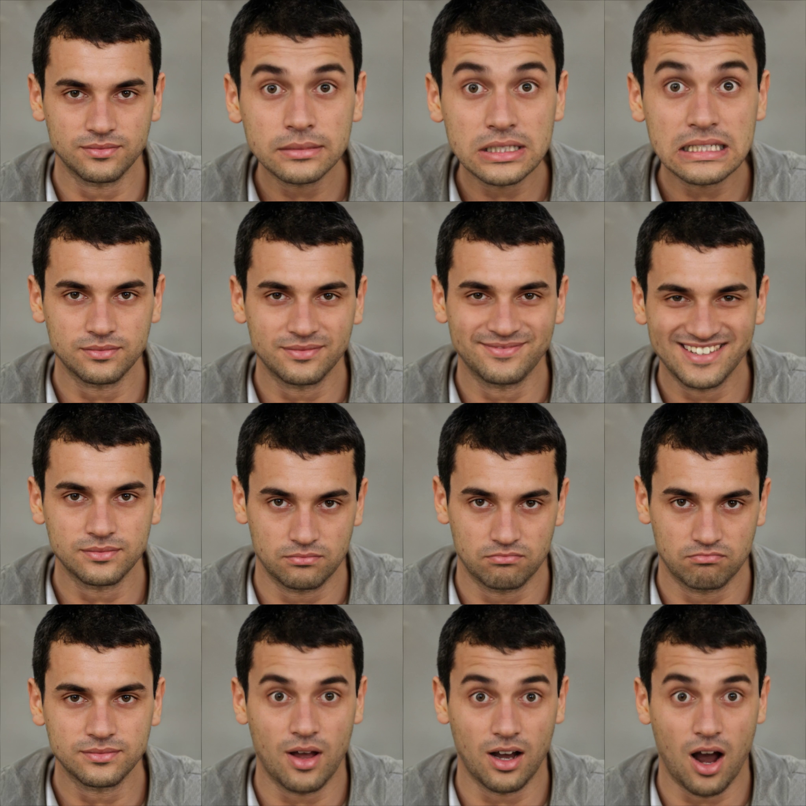

# Emotional Face Stimuli Research

As part of my work as a research assistant on emotional face stimuli research. Generation of synthetic faces that express the 6 basic emotions and varying intensity.

